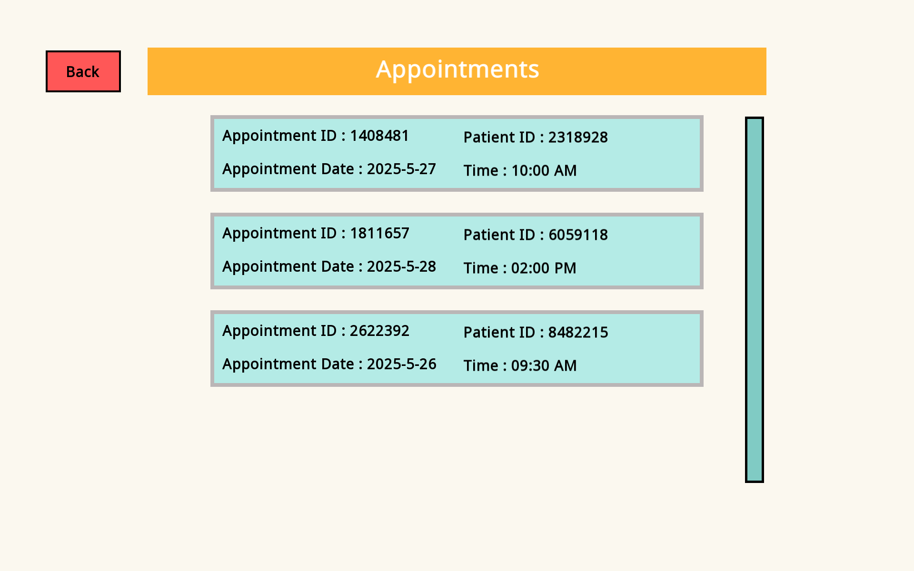

# Hospital Management System

An application for handling hospital operations like managing patient and doctor records, test scheduling, and appointment booking. It features role-based access control for different user types such as front desk operators, data entry operators, doctors, and administrators.

## Tech Stack
- **C++** - Core programming language
- **SFML (Simple and Fast Multimedia Library)** - GUI and multimedia handling
- **MySQL** - Database
- **MySQL Connector C++** - Interface between C++ and MySQL

## Overview of Users

- <u>**Front Desk Operator**</u>

    - Register a new patient.
    - Update patient details.
    - Admit and discharge a patient.
    - Schedule tests and appointments.
    - View a patient's admit history.

- <u>**Data Entry Operator**</u>
    - Push test results.

- <u>**Doctor**</u>

    - Check patient details.
    - Check appointments.
    - Write prescriptions for patients.
    - Send admit requests for patients.
    - Send test requests for patients.

- <u>**Admin**</u>

    - Add, Delete and Update doctor details.
    - View all doctors' details.

## Hospital Workflow

    

- **Patient Visit and Registration**
    
    - The Front desk operator registers a new patient.
    - The Front desk operator also schedules an appointment for the patient as per available time slots.
      

  
  

         
- **Doctor's Appointment**

    - On the scheduled date of the appointment, the doctor accesses the appointment details.
    - The Doctor will issue a prescription if necessary.
    - The Doctor can raise admit and test requests.
      

  
  

  
  

  

- **Handling Requests**

    - The Front desk operator processes and confirms the admit requests.
    - The Front desk operator schedules the tests as raised by the doctor as per available time slots.
    - The Front desk operator can discharge the patients once they have recovered.
      

  
  

- **Tests Management**

    - The Data entry operator can check pending tests of a patient.
    - The Data entry operator updates the system with test results once they have been completed.
 

  
  

- **Follow-up by Doctor**

    - The Doctor can view the test results pushed by the data entry operator.
    - The Doctor can also review the patient's medical history and records.

  
  

- **Admin Control**

    - Can register a new doctor.
    - Can update or delete the details of an existing doctor.
    - Can view the details of all doctors, using various filters like age, gender, salary and specialty

  
  

  
  

## Code Workflow

The application follows an object-oriented design to ensure modularity, scalability, and readability. Below is an overview of the core classes, their responsibilities and how they interact with each other.

- **Entity Class**

    - Base class for UI components.
    - Derived classes include Button, Text Box, Text Input Box and Image Box.
    - Each entity implements its own rendering and event-handling logic using virtual functions.

- **Screen Class**

    - Abstract base class for all UI screens.
    - Each specific screen (Home, Login, Registration, etc.) is implemented as a derived class.
    - Every screen maintains a list of entities that it contains.
    - Each screen implements its own rendering and event-handling logic using virtual functions.

- **App Class**

    - This is the central controller of the application which is instantiated in the main() function.
    - Maintains a list of all available screens in the application.
    - Manages screen transitions based on user interaction (like button clicks).
    - Renders all the entities of the current screen.
    - Acts as an interface between the Database and a Screen by transferring data to and fro.

- **Database Class**

    - Handles all interactions with the MySQL database.
    - Each database operation (insert patient, fetch appointments, etc.) is stored in a dedicated member function.
    - The App class calls these functions when needed, passing in the necessary data.
    - Results from the database class are returned to the App class for further processing or display.

## **Contributors**

- **Ravilisetty Makarandh** ([@rmak05](https://github.com/rmak05))
- **Ishan Kinger** ([@ishankinger](https://github.com/ishankinger))